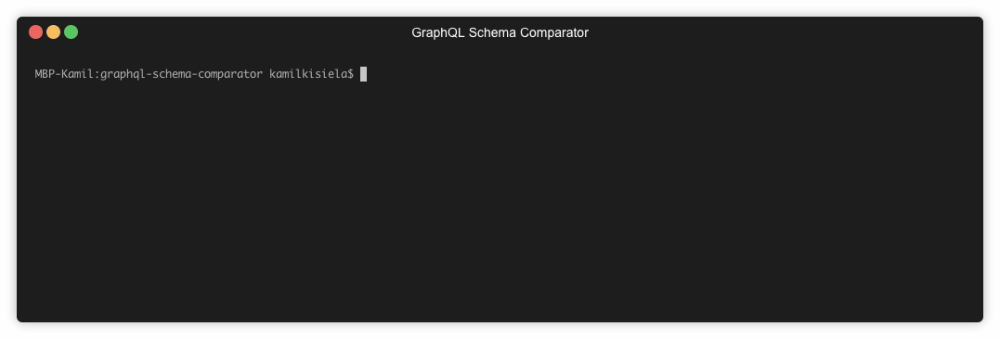

# GraphQL Inspector

[](https://circleci.com/gh/kamilkisiela/graphql-inspector)
[](https://npmjs.com/package/graphql-inspector)
[](https://github.com/prettier/prettier)
[](https://renovateapp.com/)

GraphQL Inspector ouputs a list of changes between two GraphQL schemas. Every change is precisely explained and marked as breaking, non-breaking or dangerous.
It also helps you validate documents and fragments.



## Installation

```bash
yarn add graphql-inspector
```

## CLI Usage

```bash
graphql-inspector diff OLD_SCHEMA NEW_SCHEMA
graphql-inspector help
```

### Examples

```bash
$ graphql-inspector diff OLD_SCHEMA NEW_SCHEMA

Detected the following changes between schemas:

🛑  Field `name` was removed from object type `Post`
⚠️  Enum value `ARCHIVED` was added to enum `Status`
✅  Field `createdAt` was added to object type `Post`
```

## Programatic Usage

```typescript
import { diff } from 'graphql-inspector';

const changes = diff(schemaA, schemaB);
```

## Related

This library was ported to NodeJS from [Ruby's GraphQL Schema Comparator](https://github.com/xuorig/graphql-schema_comparator)

## License

[MIT](https://github.com/kamilkisiela/graphql-inspector/blob/master/LICENSE) © Kamil Kisiela
